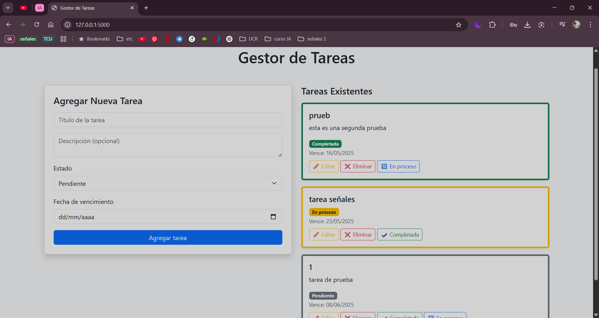
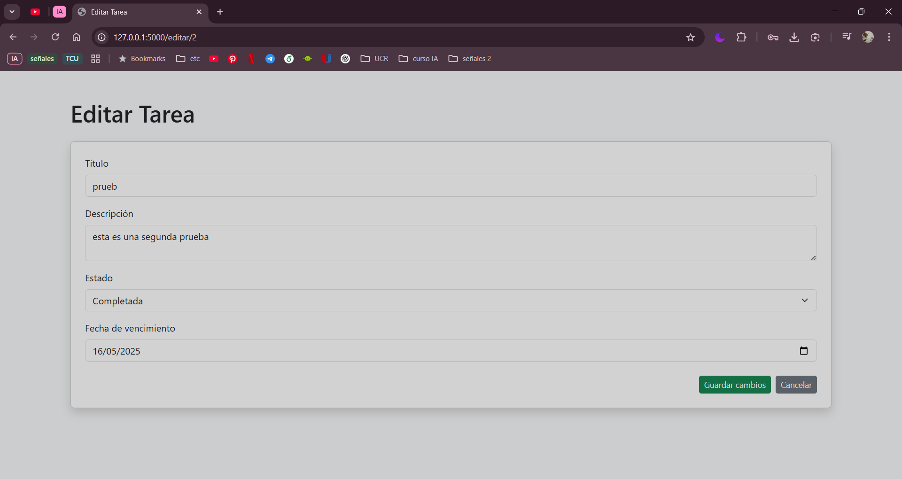

# Explicación de la App

La aplicacion lo que hace es un gestor de tareaas en las que se pueden agregar tareas nuevas y se pueden editar las tareas,  tambien desde la pagina principal se pueden marcar como completadas en proceso o eliminarse.
## URL de app
  http://127.0.0.1:5000/
## Chat con IA
  https://chatgpt.com/share/6820d7f7-dd8c-800c-b693-2de990abbed9
## Capturas de Pantalla
Aquí puedes mostrar cómo se ve tu app:

## Uso se IA

La Ia se uso principalmente para la estructura de la app y el html, despues se uso para corregir un error en la creacion de la base de datos y poner bootstrap y detalles.

## Cómo ejecutar la app localmente

Sigue estos pasos para correr la app en tu máquina:
1. Clona este repositorio:
   git clone https://github.com/AuroraIMC/tareas_IA_Aurora_Matamoros/new/master?filename=README.md
   
cd tareas_IA_Aurora_MAtamoros

3.  se activa el entorno virtual

   venv\Scripts\activate

4. iniciasr la app

   python app.py

